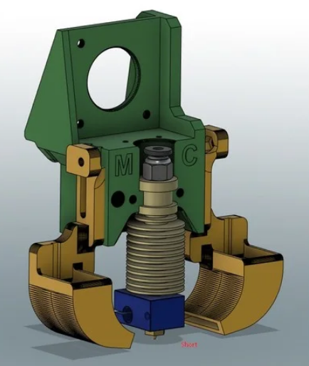
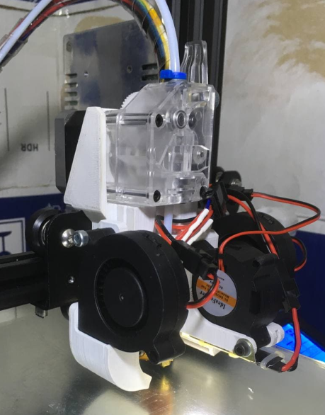

# Маунт ХевиДути под BMG экструдер

Появилось несколько вариантов маунтов на основе [heavy duty](https://www.thingiverse.com/tag:heavy_duty). Автором одного из них является [Multi Color](class:fa-paper-plane).

В качестве фидера используется BMG !вставить ссылку!, хотенд - E3Dv6 либо Vulcano. Обдув детали - две улитки 5015. Обдув
хотенда... тут возможны варианты. Либо аксиальный вентилятор закрепленный на детали прижимающей радиатор по типу уже
показанного выше [маунта](#HDTE), либо улитки. Причем имеются варианты под улитку
4020 и 5015.

Вот, например, фото, любезно предоставленное [Игорь Грач](class:fa-paper-plane) с 4020 улиткой обдува радиатора

На мой взгляд - выглядит прекрасно. Обрати внимание читатель: там еще и подсветка зоны печати интегрирована. 

Отметим особенности этого направления маунтостроения:

1. размер мотора ограничен верхней перекладиной, но стоковый мотор оси Y влезает. (Это вполне распространенная практика переставления моторов: самый большой стоковый мотор - мотор экструдера - ставится на ось Y, чтобы таскать самую тяжелую подвижную часть - стол. А мотор оси Y, соответственно, переставляется на редукторный фидер)
2. Благодаря удачному размещению мотора, который является самой тяжелой частью директ-экструдера, не возникает скручивающего момента инерции...  (много умных слов удалено)
3. Замена хотенда - требует откручивания всего двух винтов.
