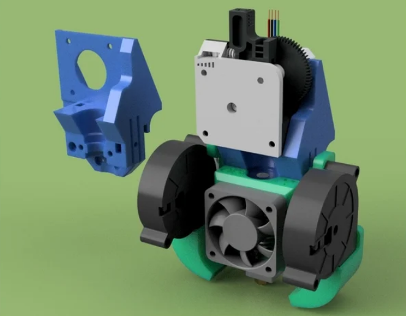

#Маунт ХевиДути под титан экструдер 

  #HDTE#

[Маунт](https://www.thingiverse.com/thing:4778095) разработанный [@Citruzzzor](class:fa-paper-plane), он-же автор маунтов [Жока](https://www.thingiverse.com/thing:4441537) и [Бока](https://www.thingiverse.com/thing:4590068)

В качестве фидера используется титан !вставить ссылку!, хотенд - E3Dv6 либо Vulcano.
Обдув детали - две улитки 5015. Обдув хотенда - аксиальный вентилятор 40мм. (Тот-же набор что в маунте "от Адольфа")

> %blank-sidebar%
> [Citruzzzor](class:fa-paper-plane)
> 
> говорят единственный косяк что не под бмг

Действительно, есть мнение, что Титан-экструдер уступает BMG. 
Типа одна подающая шестерня хуже чем две, собирать сложнее чем BMG, при сборке можно подшипник испортить, опасения по поводу возможности печати флексами (мягкими, резиноподобными пластиками, например TPU). Еще есть мнение, что только у трианглов норм титан.
Зато, значительный плюс этого маунта: возможность быстрой замены хотэнда. 
Возможно это не каждому требуется, но сама возможность радует.

> %tip%
> Вывод
>
> Одобрено сообществом к применению. По вопросам сборки (если они вдруг возникнут) всегда можно обратится [в чат](https://t.me/ender_3) сообщества.

